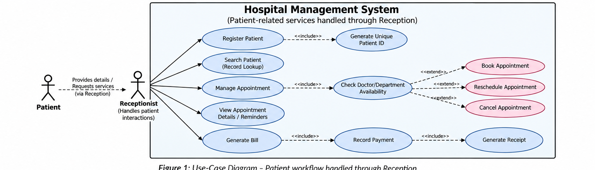
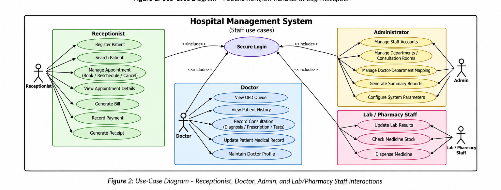

# Software Requirements Specification

# Hospital Management System

## Project Information

| Field | Details |
|---|---|
| **Project** | Hospital Management System |
| **Version** | 1.1 |
| **Authors** | HARSH RAJ (PES2UG24CS184), DASARI VINAY (PES2UG24CS145), DIYA J MARAR (PES2UG24CS162), CHRIS KHUSHNAM (PES2UG24CS139) |
| **Date** | 03-09-2026 |
| **Status** | Draft For Review |

## Revision History

| Version | Date | Author | Change Summary | Approval |
|---|---|---|---|---|
| 1.1 | 03-09-2026 | Team 2 | Corrected role consistency and revised UML use-case diagrams. | — |

## Approvals

| Role | Name | Signature / Email | Date |
|---|---|---|---|
| Course Coordinator | — | — | — |

Table of Contents
1. Introduction
2. Overall description
3. External interfaces
4. System features (detailed)
5. Non-functional requirements (detailed)
6. Quality attributes & Acceptance tests
7. System models and diagrams
8. Requirements Traceability Matrix (RTM)

## 1. Introduction
### 1.1 Purpose
This document is a Software Requirements Specification (SRS) for a Hospital Management System (HMS). It defines
the functional and non-functional requirements, interfaces, and verification criteria for a patient record and
appointment management system for hospitals, intended for instructors and students to use as a reference and for
the development team to implement against.

### 1.2 Scope
Covers patient registration, medical record maintenance, appointment scheduling for doctors/departments, doctor
and staff consultation workflows, billing and payments, basic pharmacy/laboratory record-keeping, and
administrative reporting for a single hospital or clinic. The system is implemented in C/C++ as a single-user, single-
machine application (see Section 2.5). Excludes integration with external insurance-provider systems, national health-
record registries, in-patient admission/discharge, and full hospital ERP functions (HR/payroll, procurement) beyond
what is listed above.

### 1.3 Audience
Developers, QA Engineers, Hospital Administrators, Reception Staff, Doctors, Lab/Pharmacy Staff, and Assessment
Evaluators.

### 1.4 Definitions
List of acronyms: HMS (Hospital Management System), UHID (Unique Health/Hospital ID), EMR (Electronic Medical
Record), OPD (Out-Patient Department), UI (User Interface), API (Application Programming Interface), RBAC (Role-
Based Access Control), DB (Database), PII (Personally Identifiable Information).

## 2. Overall description
### 2.1 Product perspective
The HMS is a standalone desktop/console-based application (C/C++) backed by a local, file-based or lightweight
relational database. It is a new, self-contained product; it is not a modification of an existing legacy system for the
scope of this mini project.

### 2.2 Major product functions
    ●   Patient registration and medical record management
    ●   Appointment scheduling, rescheduling, and cancellation
    ●   Doctor/staff profile management and OPD queue view
    ●   Consultation recording (diagnosis, prescriptions, recommended tests)
    ●   Billing, payment recording, and receipt generation
    ●   Basic laboratory result entry and pharmacy dispensing
    ●   Administrative master-data management, system configuration, and summary reporting

### 2.3 User roles and characteristics
    ●   Patient: provides demographic information and appointment requests through reception; does not directly
        access the system or use a login of their own.
    ●   Receptionist: frequent daily use, needs fast registration and booking screens.

●   Doctor: needs a clear daily queue and quick access to patient history during consultation.
    ●   Lab / Pharmacy Staff: needs to update results/stock against specific orders/prescriptions.
    ●   Hospital Admin: manages master data, staff accounts, system configuration, and views reports; needs
        oversight rather than transactional speed.

### 2.4 Operating environment
Desktop/console environment running on a standard PC (Windows/Linux), developed in C/C++ with a local file-based
or lightweight relational database for persistence. Single-hospital / single-site deployment for the scope of this mini
project. Only one user session is active on the system at a time; the application does not provide concurrent multi-
user or networked access (see Section 2.5 and Section 3.4). No dedicated hardware beyond a standard workstation
and printer for receipts is assumed.

### 2.5 Constraints
    ●   Single-user, single-machine operation: only one active session runs on one workstation at a time. Multi-user
        concurrent access and network / client-server deployment are explicitly out of scope for this mini project (see
        Section 3.4); requirements and diagrams elsewhere in this document are written to be consistent with this
        decision.
    ●   Implementation language restricted to C / C++ as per the project brief.
    ●   Data-privacy handling for patient medical information (see Section 5.1 Security).
    ●   Limited team size and academic-semester timeline restrict scope to the modules listed in Section 2.2.
    ●   No dependency on paid third-party services; any external interface is optional/stubbed for demonstration
        purposes.

## 3. External interface requirements
### 3.1 User interfaces
Primary UI: a menu-driven console interface (or a simple desktop GUI if implemented) with clear, numbered options
for each role (Reception, Doctor, Lab/Pharmacy, Admin). Every staff role reaches its menu only after Secure Login
(HMS-F-024). Input validation messages and confirmation prompts are shown before any data-changing action.

### 3.2 Hardware interfaces
    ●   Standard PC keyboard and display for data entry and viewing
    ●   Optional receipt/bill printer
    ●   Optional barcode/ID scanner for Patient ID lookup (future enhancement, not mandatory for this mini project)

### 3.3 Software interfaces
    ●   Local database engine (e.g., file-based storage or a lightweight relational database accessed via C/C++ file I/O
        or a DB library) for persisting patients, appointments, staff, billing, and records.
    ●   Optional export interface to generate reports/receipts as text or CSV files for printing.

### 3.4 Communications
    ●   The system is a single-machine, single-user application for the scope of this mini project: all data entry,
        processing, and storage occur on one workstation.

●   No network communication or client-server protocol is required or implemented. This is a firm scope decision
             (see Section 2.5); it supersedes any wording elsewhere that could be read as implying concurrent multi-user
             or online/networked access.

  << This SRS defines 21 functional requirements (Section 4), 5 non-functional requirements (Section 5), 3 security objectives, and 5 security
  requirements (Section 5.1), meeting the minimum of 15 FRs / 5 NFRs / 2 security objectives / 5 security requirements. >>

## 4. System features (detailed)
  Each requirement below includes acceptance criteria and a reference test case. IDs follow HMS-F-###.

### 4.1 Patient Registration & Records Management
  Description: Capture patient demographic and medical data, assign a unique identifier, and maintain a searchable, updatable medical record. IDs follow HMS-F-001..HMS-F-004.

| Req ID | Requirement (shall...) | Type | Priority | Source / Stakeholder | Acceptance criteria / Test case ref | Comments / Dependencies |
|---|---|---|---|---|---|---|
| HMS-F-001 | The system shall allow reception staff to register a new patient by capturing name, age/DOB, gender, contact details, and address. | Functional | High | Reception | AC-HMS-F-001: Record saved only after all mandatory fields pass validation. Test: TC-Reg-01 | Requires patient master DB schema |
| HMS-F-002 | The system shall auto-generate a unique Patient ID (UHID) for every new registration, and shall detect a potential duplicate registration by matching the phone number against existing records, warning reception staff and requiring explicit confirmation before a new UHID is created for a matching number. | Functional | High | Hospital Admin | AC-HMS-F-002: A matching phone number blocks creation of a new UHID; the system displays the existing record's UHID and requires staff to proceed under that existing UHID (e.g., to update the record or book against it) rather than creating a new one. Test: TC-Reg-02 | An Admin/Reception override to register a second patient sharing a household phone number is out of scope for this mini project; such cases must use a distinct contact number. |
| HMS-F-003 | The system shall allow the doctor to add or update a patient's medical history, known allergies, and current medications. | Functional | High | Doctor | AC-HMS-F-003: Update is timestamped and the prior version is retained. Test: TC-Rec-01 | Needs audit-trail support (HMS-SR-004) |
| HMS-F-004 | The system shall allow staff to search for a patient record by Patient ID, name, or phone number. | Functional | Medium | Reception / Doctor | AC-HMS-F-004: Matching record(s) returned within 2 seconds for a database of up to 100,000 patients. Test: TC-Rec-02 | — |

### 4.2 Appointment Scheduling
  Description: Allow reception staff to book, reschedule, and cancel appointments against a doctor's available slots without conflicts. IDs follow HMS-F-010..HMS-F-013.

| Req ID | Requirement (shall...) | Type | Priority | Source / Stakeholder | Acceptance criteria / Test case ref | Comments / Dependencies |
|---|---|---|---|---|---|---|
| HMS-F-010 | The system shall allow reception staff to book an appointment with a chosen doctor/department for an available time slot. | Functional | High | Reception | AC-HMS-F-010: Slot is marked booked and a confirmation is shown only if the slot was previously free. Test: TC-App-01 | — |
| HMS-F-011 | The system shall prevent a new appointment from being booked into a doctor's time slot that already has a confirmed, active appointment (double-booking prevention). | Functional | High | Doctor / Reception | AC-HMS-F-011: An attempt to book an already-booked slot is rejected with a clear error message before the record is saved; the existing appointment is unaffected. Test: TC-App-02 | Requires a slot-availability check immediately before the booking is written to storage |
| HMS-F-012 | The system shall allow an existing appointment to be rescheduled or cancelled up to a configurable cutoff time before the slot. | Functional | Medium | Reception | AC-HMS-F-012: Cancelled or rescheduled slot is released back to the available pool immediately. Test: TC-App-03 | Cutoff value is set via HMS-F-052 |
| HMS-F-013 | The system shall display/issue a reminder for a confirmed appointment at least 24 hours before the scheduled time. | Functional | Medium | Patient | AC-HMS-F-013: Reminder entry generated for every confirmed appointment within the 24-hour window. Test: TC-App-04 | Console/in-app notification for prototype scope |

### 4.3 Doctor / Staff Management & Consultation
Description: Authenticate staff, maintain doctor and staff profiles, present each doctor's daily queue, and record consultation outcomes. IDs follow HMS-F-020..HMS-F-024.

| Req ID | Requirement (shall...) | Type | Priority | Source / Stakeholder | Acceptance criteria / Test case ref | Comments / Dependencies |
|---|---|---|---|---|---|---|
| HMS-F-020 | The system shall maintain a doctor profile including specialization, department, and weekly availability. | Functional | High | Admin | AC-HMS-F-020: Doctor appears in the booking screen only during declared availability windows. Test: TC-Doc-01 | — |
| HMS-F-021 | The system shall allow a logged-in doctor to view their own daily/weekly appointment queue (OPD list). | Functional | High | Doctor | AC-HMS-F-021: Queue is sorted by appointment time and shows only that doctor's patients. Test: TC-Doc-02 | Requires RBAC (HMS-SR-001) and login (HMS-F-024) |
| HMS-F-022 | The system shall allow a doctor to record diagnosis, prescriptions, and recommended tests during a consultation. | Functional | High | Doctor | AC-HMS-F-022: Consultation entry is linked to both the patient record and the originating appointment ID. Test: TC-Doc-03 | — |
| HMS-F-023 | The system shall allow Admin to create, update, or deactivate doctor/reception staff accounts. | Functional | Medium | Admin | AC-HMS-F-023: A deactivated account cannot log in and the action is recorded in the audit log. Test: TC-Staff-01 | — |
| HMS-F-024 | The system shall require every staff user (Receptionist, Doctor, Lab/Pharmacy Staff, Admin) to log in with a valid username and password before any role-specific screen or action becomes available. | Functional | High | Admin / All Staff | AC-HMS-F-024: An unauthenticated user is shown only the login screen; a successful login routes the user to the correct role-based menu per HMS-SR-001; failed attempts are handled per HMS-SR-003. Test: TC-Auth-01 | Requires HMS-SR-001 (RBAC), HMS-SR-002 (password storage), HMS-SR-003 (lockout). Does not apply to the Patient role, which has no login of its own (Section 2.3). |

### 4.4 Billing & Payments
Description: Generate itemized bills for a patient visit, record payments, and issue receipts. IDs follow HMS-F-030..HMS-F-032.

| Req ID | Requirement (shall...) | Type | Priority | Source / Stakeholder | Acceptance criteria / Test case ref | Comments / Dependencies |
|---|---|---|---|---|---|---|
| HMS-F-030 | The system shall generate an itemized bill covering consultation, tests, and other applicable service charges on completion of a visit. | Functional | High | Receptionist | AC-HMS-F-030: Bill total equals the sum of itemized line charges; every bill has a unique bill number. Test: TC-Bill-01 | Scope is OPD visit billing; in-patient admission/bed charges are out of scope (Section 1.2) |
| HMS-F-031 | The system shall record a payment (cash / card / insurance) against a bill and update the outstanding balance. | Functional | High | Receptionist | AC-HMS-F-031: Balance is recalculated correctly after partial or full payment. Test: TC-Bill-02 | — |
| HMS-F-032 | The system shall generate a printable/exportable receipt after a successful payment. | Functional | Medium | Patient / Receptionist | AC-HMS-F-032: Receipt contains bill ID, itemized charges, payment mode, and timestamp. Test: TC-Bill-03 | — |

### 4.5 Pharmacy & Laboratory
Description: Support diagnostic result entry and pharmacy dispensing linked to a patient visit and prescription. IDs follow HMS-F-040..HMS-F-041.

| Req ID | Requirement (shall...) | Type | Priority | Source / Stakeholder | Acceptance criteria / Test case ref | Comments / Dependencies |
|---|---|---|---|---|---|---|
| HMS-F-040 | The system shall allow lab staff to record and update diagnostic test results against a patient's visit/order. | Functional | High | Lab Technician | AC-HMS-F-040: Result is linked to the correct order ID and is visible to the treating doctor. Test: TC-Lab-01 | — |
| HMS-F-041 | The system shall allow pharmacy staff to check medicine stock and dispense against a prescription, decrementing inventory. | Functional | Medium | Pharmacist | AC-HMS-F-041: Stock count reduces by the dispensed quantity; a low-stock alert triggers below the configured threshold. Test: TC-Pharm-01 | Threshold value is set via HMS-F-052 |

### 4.6 Administration & Reporting
Description: Maintain hospital master data, system configuration, and provide management-level summary reports. IDs follow HMS-F-050..HMS-F-052.

| Req ID | Requirement (shall...) | Type | Priority | Source / Stakeholder | Acceptance criteria / Test case ref | Comments / Dependencies |
|---|---|---|---|---|---|---|
| HMS-F-050 | The system shall allow Admin to manage hospital master data: departments, consultation rooms, and doctor-department mapping. | Functional | Medium | Admin | AC-HMS-F-050: Master data changes are reflected immediately in booking and billing modules. Test: TC-Admin-01 | Consultation rooms are tracked as master data only; no in-patient admission/discharge or bed-allocation workflow is in scope (Section 1.2). |
| HMS-F-051 | The system shall generate summary reports (daily patient count, revenue, doctor-wise appointments) for a selected date range. | Functional | Medium | Admin / Hospital Management | AC-HMS-F-051: Report totals match the underlying transactional data for the selected range. Test: TC-Rep-01 | — |
| HMS-F-052 | The system shall allow Admin to view and update configurable system parameters, including the appointment cancellation/reschedule cutoff time (HMS-F-012), the failed-login lockout cooldown period (HMS-SR-003), and the low-stock alert threshold (HMS-F-041). | Functional | Medium | Admin | AC-HMS-F-052: Updated parameter values take effect for subsequent operations without requiring a rebuild of the application. Test: TC-Admin-02 | Values persisted in master-data/configuration store |

## 5. Non-functional requirements (detailed)
NFRs below are measurable and tied to test plans. IDs follow HMS-NF-###.

 Req ID           Requirement                                Category                Priority       Acceptance criteria / Measurement
                  Patient search and appointment
                  booking screens shall respond within 3                                            90th-percentile response ≤ 3s
                  seconds for 90% of operations when the                                            measured against a test dataset of up
 HMS-NF-001       system holds up to 100,000 patient     Performance                 High           to 100,000 patient records on
                  records, running as a single active                                               representative hardware. Test: TC-
                  session on the target workstation                                                 Perf-01
                  hardware.
                  The system shall be available during
                                                                                                    Uptime logs show ≥ 99% availability
                  hospital operating hours (06:00-22:00)     Reliability /
 HMS-NF-002                                                                          High           during operating hours per month.
                  with unplanned downtime not                Availability
                                                                                                    Test: Ops log review
                  exceeding 1 hour per month.
                                                                                                    Storage and transmission audit
                  Patient medical data and PII shall never   Security /
 HMS-NF-003                                                                          High           confirms no plaintext PII/medical
                  be stored or transmitted in plaintext.     Compliance
                                                                                                    fields. Test: TC-Sec-01
                  The codebase shall be organized into
                  independent C/C++ modules                                                         Module interface documentation
                  (registration, appointment, records,                                              exists and a sample module change
 HMS-NF-004                                                  Maintainability         Medium
                  billing) with documented interfaces so a                                          requires no edits outside its own files.
                  module can be modified without                                                    Test: Code review checklist
                  breaking others.
                  A new reception staff member shall be
                                                                                                    Usability test with 3 new users shows
                  able to complete a patient registration
 HMS-NF-005                                                  Usability               Medium         average task completion ≤ 5 minutes.
                  within 5 minutes after 30 minutes of
                                                                                                    Test: TC-UX-01
                  training.

### 5.1 Security

### 5.1.1 Security Objectives
    ●     Confidentiality: protect patient medical records and PII from unauthorized access, both at rest and in use.
    ●     Integrity: ensure medical records, prescriptions, and billing data can only be modified by authorized users,
          with all changes auditable.
    ●     Availability: keep critical patient-care functions (registration, appointment booking, record retrieval)
          accessible during hospital operating hours despite common failure or misuse scenarios.

### 5.1.2 Security Requirements

Req ID        Requirement (shall...)                           Type        Priority   Acceptance criteria / Test case ref
               The system shall enforce role-based access
               control (RBAC) restricting each staff user                              AC-HMS-SR-001: A user attempting an
 HMS-SR-001    (Reception, Doctor, Lab, Pharmacy, Admin)        Security    High       out-of-role action is denied and the
               to only the modules and data relevant to                                attempt is logged. Test: TC-Sec-02
               their role.
               The system shall require a unique username
               and password (minimum length and                                        AC-HMS-SR-002: Password database
 HMS-SR-002    complexity enforced) for every staff login;      Security    High       inspection shows only salted hashes,
               passwords shall be stored using a salted                                never plaintext. Test: TC-Sec-03
               hash, never in plaintext.
               The system shall lock a staff account for a                             AC-HMS-SR-003: The 6th consecutive
               configurable cooldown period after 5                                    failed attempt is rejected with the
 HMS-SR-003                                                     Security    High
               consecutive failed login attempts and log                               account locked and an audit entry
               the lockout event.                                                      created. Test: TC-Sec-04
               The system shall maintain an audit trail
                                                                                       AC-HMS-SR-004: Every tested CRUD
               (user ID, timestamp, action) for every
 HMS-SR-004                                                     Security    High       action on records/billing produces a
               create/update/delete operation on patient
                                                                                       matching audit-log entry. Test: TC-Sec-05
               medical records and billing data.
               The system shall restrict direct database/file
               access to the application's own service
                                                                                       AC-HMS-SR-005: File-permission review
               account or process, and shall encrypt
                                                                                       confirms data access is limited to the
               sensitive data fields at rest (e.g., patient PII,
                                                                                       application's own process; sensitive non-
 HMS-SR-005    medical record contents, payment/billing          Security   Medium
                                                                                       password fields are verified encrypted at
               details). Staff passwords remain stored only
                                                                                       rest; password fields are verified to be
               as salted hashes per HMS-SR-002 and are
                                                                                       salted hashes only. Test: TC-Sec-06
               never separately encrypted or stored in
               plaintext.

## 6. Quality attributes & Acceptance tests
Exit criteria for acceptance: all high-priority functional requirements implemented and verified, no critical NFR
failures, and the RTM (Section 8) shows all listed test cases passed.
Acceptance test suites: Patient Registration, Appointment Scheduling, Authentication & Access Control, Consultation
& Records, Billing, Pharmacy/Lab, Performance, and Security.

## 7. System models and diagrams
### 7.1 UML Use-Case diagrams
Two use-case diagrams are provided: one showing the patient workflow handled indirectly through Reception, and
one covering the internal hospital-staff use cases (Receptionist, Doctor, Admin, Lab/Pharmacy Staff). Both diagrams
have been revised to match the requirements in Section 4 and the single-user, single-machine scope in Section 2.5.
The staff diagram includes Secure Login (HMS-F-024) and Configure System Parameters (HMS-F-052), with
representative <<include>> relationships shown.

## 7. System models and diagrams

### 7.1 UML Use-Case diagrams

### Figure 1 — Patient / Reception Use-Case Diagram

### Figure 2 — Staff Use-Case Diagram

## 8. Requirements Traceability Matrix (RTM)

Every requirement in Sections 4 and 5 is traced below to its defining section, implementing module, and reference test case(s). Status: N = Not implemented, P = In progress, A = Accepted.

### Original RTM Content

| Req ID | Requirement (short) | Section ref | Module | Test case(s) | Status (N/P/A) | Comments |
|---|---|---|---|---|---|---|
| HMS-F-001 | Register patient | 4.1 | RegistrationModule | TC-Reg-01 | N |  |
| HMS-F-002 | Unique Patient ID / block duplicate | 4.1 | RegistrationModule | TC-Reg-02 | N |  |
| HMS-F-003 | Update medical history | 4.1 | RecordsModule | TC-Rec-01 | N |  |
| HMS-F-004 | Search patient record | 4.1 | RecordsModule | TC-Rec-02 | N |  |
| HMS-F-010 | Book appointment | 4.2 | AppointmentModule | TC-App-01 | N |  |
| HMS-F-011 | Prevent double-booking | 4.2 | AppointmentModule | TC-App-02 | N | Single-user slot check |
| HMS-F-012 | Reschedule / cancel appointment | 4.2 | AppointmentModule | TC-App-03 | N | Cutoff via HMS-F-052 |
| HMS-F-013 | Appointment reminder | 4.2 | AppointmentModule | TC-App-04 | N |  |
| HMS-F-020 | Maintain doctor profile | 4.3 | StaffModule | TC-Doc-01 | N |  |
| HMS-F-021 | Doctor OPD queue view | 4.3 | ConsultationModule | TC-Doc-02 | N |  |
| HMS-F-022 | Record consultation | 4.3 | ConsultationModule | TC-Doc-03 | N |  |
| HMS-F-023 | Manage staff accounts | 4.3 | StaffModule / AuthModule | TC-Staff-01 | N |  |
| HMS-F-024 | Staff login / authentication | 4.3 | AuthModule | TC-Auth-01 | N | New in v1.1 |
| HMS-F-030 | Generate itemized bill | 4.4 | BillingModule | TC-Bill-01 | N | OPD charges only |
| HMS-F-031 | Record payment | 4.4 | BillingModule | TC-Bill-02 | N |  |
| HMS-F-032 | Generate receipt | 4.4 | BillingModule | TC-Bill-03 | N |  |
| HMS-F-040 | Record lab result | 4.5 | LabModule | TC-Lab-01 | N |  |
| HMS-F-041 | Dispense / decrement stock | 4.5 | PharmacyModule | TC-Pharm-01 | N | Threshold via HMS-F-052 |
| HMS-F-050 | Manage master data | 4.6 | AdminModule | TC-Admin-01 | N |  |
| HMS-F-051 | Generate summary reports | 4.6 | ReportingModule | TC-Rep-01 | N |  |
| HMS-F-052 | Configure system parameters | 4.6 | AdminModule | TC-Admin-02 | N | New in v1.1 |
| HMS-NF-001 | Response time target | 5 | UI / Core Modules | TC-Perf-01 | N |  |
| HMS-NF-002 | Availability target | 5 | Core Modules | Ops log review | N |  |
| HMS-NF-003 | No plaintext PII/medical data | 5 | DataAccessModule | TC-Sec-01 | N |  |
| HMS-NF-004 | Modular codebase | 5 | All Modules | Code review checklist | N |  |
| HMS-NF-005 | New-user task completion time | 5 | UI | TC-UX-01 | N |  |
| HMS-SR-001 | Role-based access control | 5.1.2 | AuthModule | TC-Sec-02 | N |  |
| HMS-SR-002 | Password hashing | 5.1.2 | AuthModule | TC-Sec-03 | N |  |
| HMS-SR-003 | Account lockout | 5.1.2 | AuthModule | TC-Sec-04 | N | Cooldown via HMS-F-052 |
| HMS-SR-004 | Audit trail on records/billing | 5.1.2 | AuditModule | TC-Sec-05 | N |  |
| HMS-SR-005 | Restrict DB access / encrypt sensitive fields | 5.1.2 | DataAccessModule | TC-Sec-06 | N |  |

### Clean Matrix View

